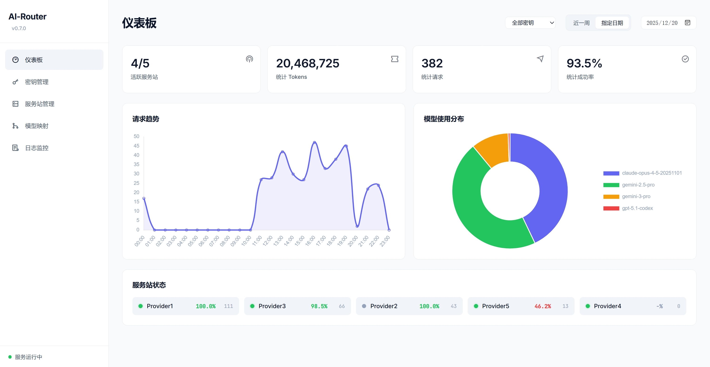
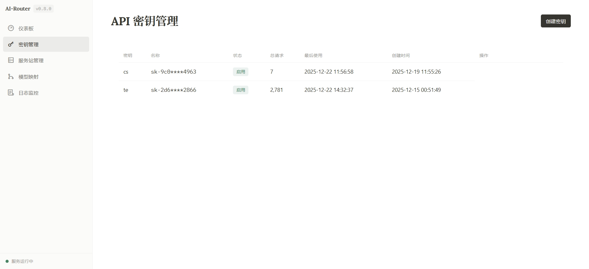
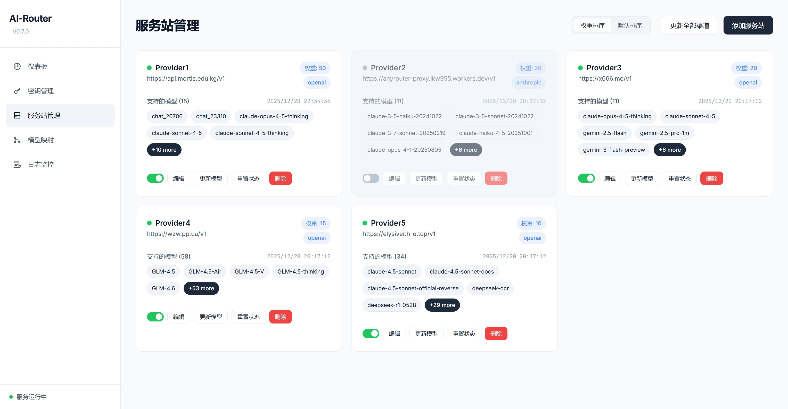

<div align="center">
  <br />
  <picture>
    <source media="(prefers-color-scheme: dark)" srcset="https://readme-typing-svg.herokuapp.com?font=Fira+Code&size=32&pause=1000&color=00BFFF&center=true&vCenter=true&width=435&lines=AI-Router-Lite">
    
  </picture>
  <br />
  <p><strong>一个专为个人开发者设计的轻量级、高性能、一体化 AI 模型聚合路由。</strong></p>
  <p>
    <a href="https://python.org"></a>
    <a href="https://fastapi.tiangolo.com/"></a>
    <a href="https://github.com/Yorag/AI-Router-Lite/blob/main/LICENSE"></a>
    <a href="#"></a>
  </p>
</div>

---

**AI-Router-Lite** 是一个专为个人开发者和小型团队设计的 AI 模型聚合网关。它致力于解决在使用多个（免费或付费）AI 模型中转服务时普遍存在的几大痛点：

- **可用性时好时坏？** → 内置**双层熔断机制**和**自动故障转移**，无感自动绕过失效服务，确保您的请求始终在线。
- **模型列表混乱且随时变动？** → 强大的**增强型模型映射**功能，支持**一键/定时从上游服务拉取最新模型列表**，并通过关键字、正则等规则，将杂乱的模型名统一为您自定义的规范名称（例如，将 `claude-opus-4-5`、`claude-opus-4.5`、`claude-opus-4-5-20251101` 全部统一为 `claude-opus-4-5`）。
- **API 端点不统一？** → 项目会自动将请求**透传**至匹配的协议端点（如 `/v1/chat/completions`, `/v1/messages`），您无需关心底层具体路径。

简而言之，AI-Router-Lite 为您屏蔽了底层渠道的复杂性和不稳定性，提供一个稳定、可靠、且始终保持更新的 AI 模型访问入口。

## 🎨 管理面板预览

一个强大且直观的 Web UI，让你对所有服务状态和配置了如指掌。

<table>
  <tr>
    <td align="center"><b>📊 仪表板</b></td>
    <td align="center"><b>🔑 密钥管理</b></td>
  </tr>
  <tr>
    <td></td>
    <td></td>
  </tr>
  <tr>
    <td align="center"><b>🌐 服务站管理</b></td>
    <td align="center"><b>🔄 模型映射</b></td>
  </tr>
  <tr>
    <td></td>
    <td></td>
  </tr>
</table>

## ✨ 核心功能

| 功能 | 描述 |
| :--- | :--- |
| 🌐 **多协议路由** | 支持 **OpenAI, Anthropic, Gemini** 等多种 API 协议的**原生透传**，自动将请求路由至正确的上游端点。 |
| 🔄 **增强型模型映射** | 通过关键字、正则、前缀等多种规则灵活地将统一模型名映射到不同渠道的实际模型。 |
| 🔌 **双层熔断机制** | **渠道级 + 模型级**双重保障。对 4xx/5xx/超时等错误进行智能分级冷却，最大化服务可用性。 |
| 🩺 **智能健康检测** | 主动探测、被动记录，自动更新模型健康状态并与熔断系统联动，确保请求总是发往健康的节点。 |
| 🔀 **智能故障转移** | 当首选渠道失败时，无感切换到备用渠道重试，按权重选择最佳路径，保证服务连续性。 |
| 💾 **高性能存储** | 基于 **SQLite (WAL 模式)**，配置与日志分离存储。敏感数据（如 API Key）通过 **Fernet** 加密，安全可靠。 |
| 🖥️ **可视化管理** | 提供功能完善的管理面板，轻松完成密钥、服务站、模型映射、健康检测和日志监控等所有配置。 |

## ⭐ 项目特色功能实现概览

### 1) 模型映射（统一模型名 → 多服务站真实模型）

- 以**统一模型名**为中心维护映射条目，支持多种匹配规则（关键字 / 前缀 / 正则 / 精确匹配 / 关键字排除 / 手动包含 / 渠道排除），将不同上游的**杂乱模型名**统一为你期望的规范名称。
- 支持将规则解析结果固化为 `resolved_models`，路由时仅在该集合内选择候选 `(Provider, Model)` 组合，避免误路由到未被映射允许的模型。
- 支持按 `(provider_id, model_id)` 维度配置协议类型，配合多协议路由实现**同一统一模型在不同服务站可使用不同协议**。
- 支持**模型列表自动更新/定时同步**：后台任务会周期性检查同步配置，从上游服务站拉取最新模型列表并写入本地模型库，然后自动触发全量映射同步刷新 `resolved_models`，确保路由候选始终与上游保持一致。

### 2) 双层熔断机制（渠道级 + 模型级）

- **渠道级熔断**：影响整个服务站（Provider）。典型场景包括鉴权失败（如 401/403）触发永久禁用、超时/网络错误触发短期冷却；冷却到期后自动恢复可用。
- **模型级熔断**：仅影响特定的 `(Provider, Model)` 组合。典型场景包括 429 超频、5xx 服务错误、404 模型不存在、健康检测失败等；在不牺牲整个服务站的情况下，精确隔离问题模型。
- 冷却策略与时间统一由常量集中管理，确保行为可预期且易于调参。

### 3) 故障转移（Failover / Retry）

- **两阶段选择**：对同一个统一模型，系统首先按权重随机选择可用渠道，然后在该渠道内选择具体模型，不会因某渠道模型数量多而被过度选中。
- **Sticky Model**：同一渠道下优先使用上次成功的模型，减少不必要的随机切换；**按 API 密钥隔离**（不同密钥有独立偏好）；请求失败时自动清除 sticky 并触发熔断。
- 若请求失败，会自动切换到下一个候选渠道继续重试，直到成功或候选耗尽。
- **保底机制**：当统一模型下所有候选都被熔断时，自动选择权重最高渠道的第一个模型作为保底进行最后尝试；保底成功后自动重置该模型的熔断状态。
- 每次失败都会被记录、并联动更新健康状态与熔断状态，形成"越用越稳"的自适应稳定性闭环。

## 🚀 快速开始

### 1. 环境准备
确保你的系统已安装 **Python 3.8+**。

### 2. 安装依赖
```bash
# 创建并激活虚拟环境
python -m venv venv
# Windows
venv\Scripts\activate
# Unix/Mac
source venv/bin/activate

# 安装依赖
pip install -r requirements.txt
```

### 3. 生成加密密钥并设置环境变量
运行脚本生成用于保护数据库敏感信息的密钥。
```bash
python scripts/gen_fernet_key.py
```
将输出的密钥设置为环境变量：
```bash
# Windows PowerShell
$env:AI_ROUTER_ENCRYPTION_KEY = "生成的密钥"

# Unix/Mac
export AI_ROUTER_ENCRYPTION_KEY="生成的密钥"
```
> ⚠️ **请务必妥善保管此密钥**，它是解密数据库中 API Key 的唯一凭证。

### 4. 创建配置文件（可选）
复制配置模板进行自定义配置。如果不创建，将使用默认值。
```bash
cp config.example.json config.json
```

### 5. 初始化数据库
首次运行前，执行以下命令创建数据库和表结构。
```bash
python scripts/init_db.py
```

### 6. 启动服务
```bash
python main.py
```
服务启动后，即可通过 `http://127.0.0.1:8000/admin` 访问管理面板。

### 7. 首次登录设置
首次访问管理面板时，系统会要求您设置管理员密码（至少 8 位）。设置完成后，使用该密码登录即可开始使用。

> 🔐 **安全提示**：管理面板已启用认证保护，所有管理 API 端点均需要登录后才能访问。

### 8. 忘记密码
如果忘记管理员密码，可运行以下命令重置：
```bash
python scripts/reset_admin.py
```
重置后重启服务，访问管理面板即可重新设置密码。

## ⚙️ 配置说明

### 环境变量

| 变量名 | 必填 | 说明 |
| :--- | :---: | :--- |
| `AI_ROUTER_ENCRYPTION_KEY` | ✅ | Fernet 加密密钥，用于加密数据库中的敏感信息（API Key 等） |
| `AI_ROUTER_PORT` | ❌ | 服务端口，覆盖配置文件中的 `server_port` |
| `AI_ROUTER_HOST` | ❌ | 服务主机，覆盖配置文件中的 `server_host` |

### 配置文件 (`config.json`)

所有配置项均为**选填**，未配置时使用默认值。

```jsonc
{
  // 服务器配置
  "server_port": 8000,           // 服务端口（默认: 8000）
  "server_host": "0.0.0.0",      // 服务主机（默认: 0.0.0.0）
  "request_timeout": 120,        // 请求超时时间，秒（默认: 120）

  // 时区与日志
  "timezone_offset": 8,          // 时区偏移量，如 8 表示 UTC+8（默认: 8）
  "log_retention_days": 15,      // 日志保留天数（默认: 15）

  // 熔断器冷却时间配置（秒）
  "cooldown": {
    "rate_limited": 180,         // 429 超频冷却时间（默认: 180）
    "server_error": 600,         // 5xx 服务器错误冷却时间（默认: 600）
    "timeout": 300,              // 超时冷却时间（默认: 300）
    "network_error": 120         // 网络错误冷却时间（默认: 120）
  },

  // 认证配置
  "auth": {
    "token_expire_hours": 6,           // JWT 令牌有效期，小时（默认: 6）
    "lockout_duration_seconds": 900    // 登录失败锁定时间，秒（默认: 900）
  }
}
```

> 💡 **配置优先级**：环境变量 > config.json > 默认值

## 🛠️ 使用方法

在支持 OpenAI/Anthropic/Gemini 协议的客户端（如 NextChat, LobeChat 等）中，将 **API Host** 指向 `http://127.0.0.1:8000`，API Key 填写在管理面板中创建的密钥，即可开始使用。

### API 接口说明

| 端点 | 方法 | 说明 |
| :--- | :--- | :--- |
| `/v1/models` | GET | 获取可用模型列表（返回管理面板中配置的统一模型名） |
| `/v1/chat/completions` | POST | OpenAI Chat Completions 协议 |
| `/v1/responses` | POST | OpenAI Responses 协议 (Beta) |
| `/v1/messages` | POST | Anthropic Messages 协议 |
| `/v1beta/models/{model}:generateContent` | POST | Gemini 协议 |

> 💡 **提示**：对话请求的端点取决于您在管理面板「模型映射」中为统一模型配置的协议类型。系统会根据配置自动将请求透传至对应的上游端点。

## 🔧 技术栈

- **后端**: FastAPI, Uvicorn
- **HTTP 客户端**: HTTPX
- **数据库**: SQLite
- **加密**: Cryptography (Fernet)
- **前端**: Vanilla JS, HTML, CSS

## 🗺️ 路线图

- [x] **v0.1-v0.4**: 实现核心转发、流式响应、熔断及基础 Web UI。
- [x] **v0.5 (Intelligence)**: 增强型模型映射、健康检测、双层熔断。
- [x] **v0.6 (Refactor)**: 引入 Provider ID 体系，支持并发同步。
- [x] **v0.7 (Protocol & Storage)**:
  - 多协议**路由**支持（OpenAI, Anthropic, Gemini 等）
  - 双层协议配置机制
  - **SQLite 持久化存储**（替代 JSON 文件）
  - **Fernet 加密**保护敏感数据
  - 关键字排除规则
  - 被动健康记录
- [x] **v0.7.1 (Refactor & Stability)**:
  - **架构重构**: 统一状态管理，解耦核心模块，修复循环依赖。
  - **代码规范**: 引入 Pydantic 模型统一管理，优化数据库完整性。
  - **注意**: 从旧版本升级需要运行 `python scripts/migrate_db_v1.py`。
- [x] **v0.8 (UI Overhaul)**:
  - **UI 重构**: 采用 Notion 风格设计系统，全面优化视觉体验。
  - **Tooltip 系统**: 引入集中式 Tooltip，展示丰富的模型健康数据。
  - **前端模块化**: 重构前端资源结构，统一工具函数和组件渲染。
- [x] **v0.9 (Authentication & Security)**:
  - **管理面板认证**: 新增独立登录页面，支持管理员密码认证。
  - **JWT 会话管理**: 基于 JWT 的安全会话机制，支持自动过期。
  - **防暴力破解**: 登录失败次数限制（5 次后锁定 15 分钟）。
  - **认证日志记录**: 登录成功/失败均记录日志，包含客户端 IP。
  - **日志筛选增强**: 新增 Auth 类型日志筛选。
- [ ] **v1.0 (Protocol Conversion)**: 引入协议转换层，实现将多种 API 格式（如 Anthropic, Gemini）统一为 OpenAI Chat Completions 格式输出。完整稳定版本，包含负载均衡优化、完善的文档和测试覆盖。

## 📄 许可

本项目采用 [MIT License](https://github.com/Yorag/AI-Router-Lite/blob/main/LICENSE) 授权。